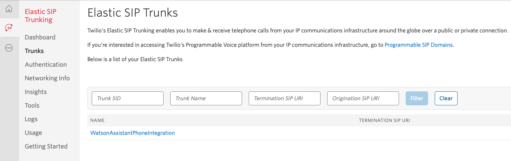
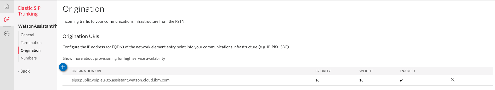
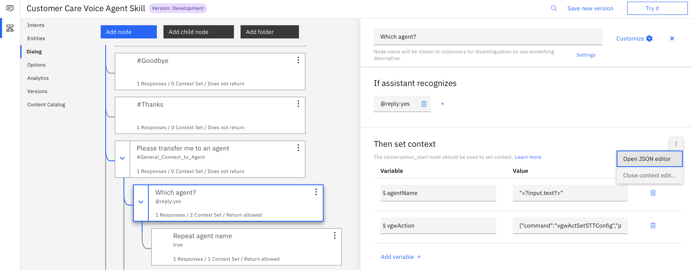

# Automating Call Centers with Voice Agent on IBM Cloud

This code pattern is a Voice Agent with Watson application that enables companies to automate their call centers using Watson Assistant, Text to Speech, and Speech to Text, without having to orchestrate between all the different services yourself; the Voice Agent will do that for you.

When the reader has completed this code pattern, they will understand how to:

* Provision Voice Agent, Watson Assistant, Watson Speech to Text, and Watson Text to Speech services on IBM Cloud.
* Import a sample call center dialog to Watson Assistant.
* Improve Speech To Text accuracy by creating a custom language model, using a grammar.
* Connect Voice Agent to Twilio via the SIP communication protocol.


## Flow

1. User phones a call center phone number, associated with a Twilio account.
2. The Twilio number connects to a configured Voice Agent service on IBM Cloud via the SIP communication protocol.
3. Voice Agent calls Watson Speech to Text to transcribe user input.
4. Based on user input, certain flows in Watson Assistant will be triggered.  As required, the flow will switch between a general purpose or customized Speech to Text model.
5. Text responses from Watson Assistant will be transmitted back to the Voice Agent service via Watson Text to Speech.
6. Voice Agent sends the audio back via the Twilio Elastic SIP Trunk.
7. The resulting audio is played back to the user.

## Included components

* [Voice Agent with Watson](https://cloud.ibm.com/catalog/services/voice-agent-with-watson): Build cognitive voice agent apps that use natural language over the telephone.  Voice Agent uses Watson Assistant, Text to Speech, and Speech to Text, without having to tie them all together manually.
* [Watson Assistant](https://www.ibm.com/cloud/watson-assistant/): Create a chatbot that conducts a natural language conversation which can be embedded into an application, e.g. social media messaging app, web app, mobile or voice (using Voice Agent).
* [Watson Text to Speech](https://www.ibm.com/cloud/watson-text-to-speech): Converts written text into natural sounding audio in a variety of languages and voices.
* [Watson Speech to Text](https://www.ibm.com/cloud/watson-speech-to-text): A service that converts human voice into written text.
* [Twilio](https://cloud.ibm.com/catalog?search=twillio#search_results): Integrate voice, messaging, and VoIP into your web and mobile apps.

## Prerequisites

* **Twilio account**: [Sign up for free](https://www.twilio.com/try-twilio)

## Steps

1. [Create Voice Agent with Watson service on IBM Cloud](#1-Create-Voice-Agent-with-Watson-service-on-IBM-Cloud)
2. [Configure Twilio](#2-Configure-Twilio)
3. [Configure Voice Agent and create Watson Assistant, Watson Speech to Text and Watson Text to Speech services](#3-Configure-Voice-Agent-and-create-Watson-Assistant,-Watson-Speech-to-Text-and-Watson-Text-To-Speech-services)
4. [Import the dialog skill into Watson Assistant](#4-Import-the-dialog-skill-into-Watson-Assistant)
5. [Test your voice agent](#5-Test-your-voice-agent)
6. [Improve speech recognition accuracy by creating a Watson Speech to Text custom language model with a grammar (optional)](#6-Improve-speech-recognition-accuracy-by-creating-a-Watson-Speech-to-Text-custom-language-model-with-a-grammar-(optional))

### 1. Create Voice Agent with Watson service on IBM Cloud

Start by heading over to your IBM Cloud catalog and creating the service listed below:

* [Voice Agent with Watson](https://cloud.ibm.com/catalog/services/voice-agent-with-watson)

Head over to the IBM Cloud Dashboard and launch the service we just created.

### 2. Configure Twilio

For this next section we'll create a new Twilio account. The Twilio account will provide us with a phone number and the ability to configure a SIP trunk to connect with our Voice Agent.

To create a new SIP trunk connection, go to the context menu and select the icon for _Elastic SIP Trunking_, then select the _Trunks_ sub menu. Create a new one with a unique name.



We now need to let Twilio know about our Voice Agent endpoint. Refer back to the Voice Agent service and locate the value in the **Getting started** tab.


Set the _Origination URI_ for our new SIP Trunk.



The last step is to associate a telephone number with the SIP Trunk. Click on the _Numbers_ sub menu and search for an available number.  Numbers are purchased for a small monthly fee and new Twilio accounts come with a credit balance to help you get started for free, or you can top up as required.  Purchase a number to add it to our SIP Trunk.


### 3. Configure Voice Agent and create Watson Assistant, Watson Speech to Text and Watson Text to Speech services

In the Voice Agent **Manage** tab, click the button _Create an Agent_.  Give the agent a name and enter the Twilio number we created previously.


Create a new Watson Assistant service instance (or connect to an existing one).


Create a new Watson Speech to Text service instance (or connect to an existing one).


Create a new Watson Text to Speech service instance (or connect to an existing one).


Finally, click the button _Create an Agent_ again to create the agent and assosiated Watson services.

### 4. Import the dialog skill into Watson Assistant

Now, setup your chatbot - you can either create your own chatbot or use the sample dialog skill provided in this code pattern. Launch the Watson Assistant tool and click the _Skills_ icon on the left, then _Create Skill_. Select _Dialog skill_ then _Import skill_.  Find the [`data/dialogSkill.json`](data/dialogSkill.json) file from the cloned repo and import that into the Watson Assistant tool.

Now return to the Voice Agent service and associate it with the Dialog Skill we just created.  Click the three dots icon to edit the voice agent.


In the Watson Assistant configuration section choose the _Customer Care Voice Agent Skill_ from the list.  Click the _Save changes_ button.


You're now ready to test things out!

### 5. Test your voice agent

Try calling your Twilio phone number. You'll be greeted with the start of your Watson Assistant dialog skill. Try a few of the questions below to hear back the answers.

* _What are the hours of operation?_
* _What's your location?_
* _I'd like to make an appointment_

### 6. Improve speech recognition accuracy by creating a Watson Speech to Text custom language model with a grammar (optional)

By default, the voice agent uses Watson Speech To text with a base vocabulary containing many words that are used in everyday conversation. Its models provide sufficiently accurate recognition for many applications, but they can lack knowledge of specific terms that are associated with particular domains.  The Speech to Text service offers a customization interface that you can use to augment its speech recognition capabilities to improve accuracy.  One approach for customization is to expand and tailor the vocabulary of a base model to include domain-specific terminology.  Another approach is to use a grammar to restrict the words that the service can recognize.  When creating voice agent chatbots which expect a specific response, i.e. asking the user to speak digits or a yes/no response, grammars can help the Speech to Text service deliver results faster and more accurately.

In our customer service chatbot, another possible question is _Can I speak to an advisor?_ The chatbot responds by asking the caller if there is a specific agent they'd like to speak with.  The response to this question will always be a name, and many names could have ambiguity with other words in the base model.  Using a grammar to restrict the speech recognition vocabulary should improve accuracy.

#### Create a custom language model using a grammar

Custom language models are not available on the free Lite plan for Watson Speech to Text, you'll need to upgrade to the paid Standard plan.  There is no charge for creating the model, but with the Standard plan you will be paying for the audio you transcribe.  For more details see [Watson Speech to Text Pricing](https://www.ibm.com/uk-en/cloud/watson-speech-to-text/pricing).

To create the custom language model we'll need to use the Watson Speech to Text customization interface.  Retrieve the apikey and url by launching the Speech To Text service and selecting the **Manage** tab.


Use curl to create a custom language model based on the default model used by Voice Agent, e.g. en-US_NarrowbandModel, replacing the {apikey} and {url} accordingly.

```
curl -X POST -u "apikey:{apikey}" \
--header "Content-Type: application/json" \
--data "{\"name\": \"Agent names model\", \
         \"base_model_name\": \"en-US_NarrowbandModel\", \
         \"description\": \"Custom language model using grammar for agent names\"}" \
"{url}/v1/customizations"
```

The response will be a 'customization_id' similar to this.

```
{"customization_id": "825b9060-7a7e-46ff-8a58-9e0a62035f27"}
```

#### Add a grammar to the custom language model

Find the [`data/agentNames.xml`](data/agentNames.xml) file from the cloned repo and add it to the custom language model, making reference to your customization_id retrieved previously.

```
curl -X POST -u "apikey:{apikey}" \
--header "Content-Type: application/srgs+xml" \
--data-binary @agentNames.xml \
"{url}/v1/customizations/{customization_id}/grammars/agentNames-xml"
```

The service parses the grammar to determine if there are any words that are not already part of the service's base vocabulary. Such words are referred to as out-of-vocabulary (OOV) words. Check the status with this command.

```
curl -X GET -u "apikey:{apikey}" \
"{url}/v1/customizations/{customization_id}/grammars/agentNames-xml"
```

After a few seconds, you should expect this response. In our case there are two OOV words

```
{
   "out_of_vocabulary_words": 2,
   "name": "agentNames-xml",
   "status": "analyzed"
}
```

We can inspect which words in the grammar were considered OOV and check the generated pronunciation.

```
curl -X GET -u "apikey:{apikey}" \
"{url}/v1/customizations/{customization_id}/words?word_type=grammars"
```

```
{"words": [
   {
      "display_as": "Ada",
      "sounds_like": ["Ada"],
      "count": 1,
      "source": ["agentNames-xml"],
      "word": "Ada"
   },
   {
      "display_as": "O'Keeffe",
      "sounds_like": ["O. 'Keeffe"],
      "count": 1,
      "source": ["agentNames-xml"],
      "word": "O'Keeffe"
   }
]}
```

The final step is to train the custom language model. The service processes the grammar from its original text-based format to a binary runtime format for speech recognition. You cannot use the grammar until you train the model.

```
curl -X POST -u "apikey:{apikey}" \
"{url}/v1/customizations/{customization_id}/train"
```

You can check the status with this command.

```
curl -X GET -u "apikey:{apikey}" \
"{url}/v1/customizations/{customization_id}"
```

The training is complete When the `status` field has a value of `available`.

#### Using the custom language model with Watson Assistant

Launch the Watson Assistant tool and open the _Customer Care Voice Agent Skill_, then select the _Dialog_ sub menu.  Locate the node entitled _Which agent?_


This node is asks the caller to say the name of the agent they'd like to speak to, so this is where we should switch to the custom language model.  Select the node and use the JSON Editor to update the node's response.  



Notice how the node responds with a list of output types, one of which is the "vgwAction" _action tag_ which can be used to initiate actions on Voice Agent during a call.  Replace the `customization_id` with the value for the custom language model you created previously.

The `updateMethod` with value `mergeOnce` instructs Voice Agent to merge the new configuration with the existing settings for the current turn only, i.e. we'll return to the base speech to text model for the next question.

```
{
  "output": {
    "generic": [
      {
        "values": [
          {
            "text": "Please say the agent's name to be connected."
          }
        ],
        "response_type": "text",
        "selection_policy": "sequential"
      }
    ],
    "vgwAction": {
      "command": "vgwActSetSTTConfig",
      "parameters": {
        "config": {
          "grammar_name": "agentNames-xml",
          "customization_id": "825b9060-7a7e-46ff-8a58-9e0a62035f27"
        },
        "updateMethod": "mergeOnce"
      }
    }
  },
  "context": {
    "agentName": "<?input.text?>"
  }
}
```

Try calling your Twilio phone number again. This time, ask the following question.

* _Can I speak to an agent?_

When prompted, speak one of the agent names as defined in the grammar.

```
<grammar version="1.0" xml:lang="en-US" root="agents">
  <rule id="agents">
    <one-of>
      <item> Agatha Christie </item>
      <item> Ada Lovelace </item>
      <item> Alexander Hamilton </item>
      <item> Georgia O'Keeffe </item>
      <item> Helen Keller </item>
      <item> Jacques Cousteau </item>
      <item> Louis Armstrong </item>
      <item> Kurt Vonnegut </item>
      <item> Rachel Carson </item>
    </one-of>
  </rule>
</grammar>
```

The voice agent will confirm the name it recognized, and you should experience very high accuracy.

## Links

* [Getting started with Voice Agent](https://cloud.ibm.com/docs/voice-agent?topic=voice-agent-getting-started): Instructions on how to get started with Voice Agent on IBM Cloud.
* [Getting started with Voice Gateway](https://www.ibm.com/support/knowledgecenter/en/SS4U29/gettingstarted.html): Instructions on how to get started with Voice Gateway for an on-premises installation using IBM Cloud Pak for Data, Kubernetes or Docker.
* [Watson Speech to Text Customization](https://cloud.ibm.com/docs/speech-to-text?topic=speech-to-text-customization): Learn more about the different approaches to augment speech recognition capabilities.


## Learn more

* **Artificial Intelligence Code Patterns**: Enjoyed this Code Pattern? Check out our other [AI Code Patterns](https://developer.ibm.com/technologies/artificial-intelligence/).
* **AI and Data Code Pattern Playlist**: Bookmark our [playlist](https://www.youtube.com/playlist?list=PLzUbsvIyrNfknNewObx5N7uGZ5FKH0Fde) with all of our Code Pattern videos
* **With Watson**: Want to take your Watson app to the next level? Looking to utilize Watson Brand assets? [Join the With Watson program](https://www.ibm.com/watson/with-watson/) to leverage exclusive brand, marketing, and tech resources to amplify and accelerate your Watson embedded commercial solution.

## License

This code pattern is licensed under the Apache Software License, Version 2.  Separate third party code objects invoked within this code pattern are licensed by their respective providers pursuant to their own separate licenses. Contributions are subject to the [Developer Certificate of Origin, Version 1.1 (DCO)](https://developercertificate.org/) and the [Apache Software License, Version 2](https://www.apache.org/licenses/LICENSE-2.0.txt).

[Apache Software License (ASL) FAQ](https://www.apache.org/foundation/license-faq.html#WhatDoesItMEAN)
