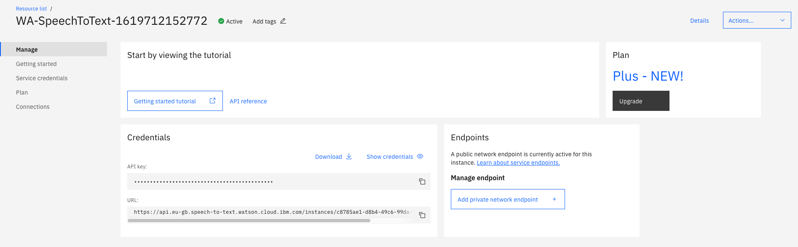

# Automating Call Centers with Watson Assistant Phone Integration on IBM Cloud

This code pattern is an application that enables companies to automate their call centers using Watson Assistant, Text to Speech, and Speech to Text, without having to orchestrate between all the different services yourself; Watson Assistant's Phone Integration will do that for you.

When the reader has completed this code pattern, they will understand how to:

* Provision Watson Assistant, Watson Speech to Text, and Watson Text to Speech services on IBM Cloud.
* Import a sample call center dialog to Watson Assistant.
* Improve Speech To Text accuracy by creating a custom language model, using a grammar.
* Connect Watson Assistant to Twilio via the SIP communication protocol.


## Flow

1. User phones a call center phone number, associated with a Twilio SIP Trunk.
2. The Twilio number connects to Watson Assistant on IBM Cloud via the SIP communication protocol.
3. Watson Assistant uses Watson Speech to Text to transcribe user input.  Based on user input, certain flows in Watson Assistant will be triggered and as required, the flow will switch between a general purpose or customized Speech to Text model.
4. Text responses from Watson Assistant will be synthesised into audio using Watson Text to Speech.
5. Watson Assistant sends the audio back via the Twilio SIP Trunk.
6. The resulting audio is played back to the user.

## Included components

* [Watson Assistant](https://www.ibm.com/cloud/watson-assistant/): Create a chatbot that conducts a natural language conversation which can be embedded into an application, e.g. social media messaging app, web app, mobile or voice (using the Phone Integration feature).
* [Watson Text to Speech](https://www.ibm.com/cloud/watson-text-to-speech): Converts written text into natural sounding audio in a variety of languages and voices.
* [Watson Speech to Text](https://www.ibm.com/cloud/watson-speech-to-text): A service that converts human voice into written text.
* [Twilio](https://www.twilio.com): Integrate voice, messaging, and VoIP into your web and mobile apps.

## Prerequisites

* **Twilio account**: [Sign up for free](https://www.twilio.com/try-twilio)

## Steps

1. [Create Watson Assistant service on IBM Cloud](#1-Create-Watson-Assistant-service-on-IBM-Cloud)
2. [Configure Twilio & Watson Assistant](#2-Configure-Twilio-and-Watson-Assistant)
3. [Import the dialog skill into Watson Assistant](#3-Import-the-dialog-skill-into-Watson-Assistant)
4. [Test your assistant](#4-Test-your-assistant)
5. [Improve speech recognition accuracy by creating a Watson Speech to Text custom language model with a grammar (optional)](#5-Improve-speech-recognition-accuracy-by-creating-a-Watson-Speech-to-Text-custom-language-model-with-a-grammar-optional)

### 1. Create Watson Assistant service on IBM Cloud

Start by heading over to your IBM Cloud catalog and creating the service listed below:

* [Watson Assistant](https://cloud.ibm.com/catalog/services/watson-assistant)

You will need to use Plus Plan or Plus Plan Trial to utilize the Phone Integration feature.

### 2. Configure Twilio and Watson Assistant

For this next section we'll create a new Twilio account.  The Twilio account will provide us with a phone number and the ability to configure a SIP trunk to connect with Watson Assistant.

To create a new SIP trunk connection, go to the context menu and select the icon for _Elastic SIP Trunking_, then select the _Trunks_ sub menu.  Create a new one with a unique name.


We now need to let Twilio know about our Watson Assistant Phone Integration endpoint.  Refer back to the Watson Assistant service, launch its tooling and _Create Assistant_.  Choose _Add integration_ and select _Phone_.


From Watson Assistant, copy the SIP URI and set this as the trunk's _Origination URI_ in Twilio.


Next, associate a telephone number with the SIP URI.  Click into the SIP trunk, select the _Numbers_ sub menu and search for an available number.  Numbers are purchased for a small monthly fee and new Twilio accounts come with a credit balance to help you get started for free, or you can top up as required.  Purchase a number to add it to your SIP Trunk.


Back in Watson Assistant, add the number to the Phone Integration configuration.


Finally, click _Create new instances_ to create Watson Speech to Text and Text to Speech services.  Ensure you set the Speech to Text base language model to `US English narrowband`, then _Save and exit_.


### 3. Import the dialog skill into Watson Assistant

Now, setup your chatbot - you can either create your own chatbot or use the sample dialog skill provided in this code pattern.  In the Watson Assistant tool, click the _Skills_ icon on the left, then _Create Skill_.  Select _Dialog skill_, _Next_ then _Upload skill_.  Find the [`data/dialogSkill.json`](data/dialogSkill.json) file from the cloned repo and import that into Watson Assistant.

Click the Assistants icon on the left and open your Assistant.  Click _Add dialog skill_ and select the dialog skill you just imported (_Customer Care Voice Agent Skill_).


You're now ready to test things out!

### 4. Test your assistant

Try calling your Twilio phone number. You'll be greeted with the start of your Watson Assistant dialog skill. Try a few of the questions below to hear back the answers.

* _What are the hours of operation?_
* _What's your location?_
* _I'd like to make an appointment_

### 5. Improve speech recognition accuracy by creating a Watson Speech to Text custom language model with a grammar (optional)

By default, Watson Speech To Text uses a base vocabulary containing many words that are used in everyday conversation.  Its models provide sufficiently accurate recognition for many applications, but they can lack knowledge of specific terms that are associated with particular domains.  The Speech to Text service offers a customization interface that provides three ways to augment its speech recognition capabilities to improve accuracy.  The first approach is to expand and tailor the vocabulary of a base model to include domain-specific terminology (e.g. unique business phrases, acronyms, product names, jargons etc.), the second is to customize the aucoustic properties to better deal with unique regional dialects and domain-specific acoustical environments.  We will use the third approach of using a grammar to restrict the words that the service can recognize.  When creating voice enabled chatbots which expect a specific response, i.e. asking the user to speak digits or a yes/no response, grammars can help the Speech to Text service deliver results faster and more accurately.

In our customer service chatbot, another possible question is _Can I speak to an advisor?_ The chatbot responds by asking the caller if there is a specific agent they'd like to speak with.  The response to this question will always be a name, and many names could have ambiguity with other words in the base model.  Using a grammar to restrict the speech recognition vocabulary should improve accuracy.

#### Create a custom language model using a grammar

Custom language models are not available on the free Lite plan for Watson Speech to Text, you'll need to upgrade to the paid Plus plan.  There is no charge for creating the model, but with the Plus plan you will be paying for the audio you transcribe.  For more details see [Watson Speech to Text Pricing](https://www.ibm.com/uk-en/cloud/watson-speech-to-text/pricing).

To create the custom language model we'll need to use the Watson Speech to Text customization interface.  Retrieve the apikey and url by launching the Speech To Text service and selecting the **Manage** tab.



Use curl to create a custom language model based on the default model we configured in Watson Assistant, e.g. en-US_NarrowbandModel, replacing the {apikey} and {url} accordingly.

```
curl -X POST -u "apikey:{apikey}" \
--header "Content-Type: application/json" \
--data "{\"name\": \"Agent names model\", \
         \"base_model_name\": \"en-US_NarrowbandModel\", \
         \"description\": \"Custom language model using grammar for agent names\"}" \
"{url}/v1/customizations"
```

The response will be a 'customization_id' similar to this.

```
{"customization_id": "825b9060-7a7e-46ff-8a58-9e0a62035f27"}
```

#### Add a grammar to the custom language model

Find the [`data/agentNames.xml`](data/agentNames.xml) file from the cloned repo and add it to the custom language model, making reference to your customization_id retrieved previously.

```
curl -X POST -u "apikey:{apikey}" \
--header "Content-Type: application/srgs+xml" \
--data-binary @agentNames.xml \
"{url}/v1/customizations/{customization_id}/grammars/agentNames-xml"
```

The service parses the grammar to determine if there are any words that are not already part of the its base vocabulary.  Such words are referred to as out-of-vocabulary (OOV) words.  Check the status with this command.

```
curl -X GET -u "apikey:{apikey}" \
"{url}/v1/customizations/{customization_id}/grammars/agentNames-xml"
```

After a few seconds, you should expect this response.  In our case there are two OOV words

```
{
   "out_of_vocabulary_words": 2,
   "name": "agentNames-xml",
   "status": "analyzed"
}
```

We can inspect which words in the grammar were considered OOV and check the generated pronunciation.

```
curl -X GET -u "apikey:{apikey}" \
"{url}/v1/customizations/{customization_id}/words?word_type=grammars"
```

```
{"words": [
   {
      "display_as": "Ada",
      "sounds_like": ["Ada"],
      "count": 1,
      "source": ["agentNames-xml"],
      "word": "Ada"
   },
   {
      "display_as": "O'Keeffe",
      "sounds_like": ["O. 'Keeffe"],
      "count": 1,
      "source": ["agentNames-xml"],
      "word": "O'Keeffe"
   }
]}
```

The final step is to train the custom language model.  The service processes the grammar from its original text-based format to a binary runtime format for speech recognition.  You cannot use the grammar until you train the model.

```
curl -X POST -u "apikey:{apikey}" \
"{url}/v1/customizations/{customization_id}/train"
```

You can check the status with this command.

```
curl -X GET -u "apikey:{apikey}" \
"{url}/v1/customizations/{customization_id}"
```

The training is complete When the `status` field has a value of `available`.

#### Using the custom language model with Watson Assistant

Launch the Watson Assistant tool and open the _Customer Care Voice Agent Skill_, then select the _Dialog_ sub menu.  Locate the node entitled _Which agent?_


This node is asks the caller to say the name of the agent they'd like to speak to, so this is where we should switch to the custom language model.  Select the node and use the JSON Editor to update the node's response.  


Notice how the node sets Watson Assistant context variables, one of which is the "vgwAction" _action tag_ which can be used to initiate actions during a call.  Replace the `customization_id` with the value for the custom language model you created previously.

The `updateMethod` with value `mergeOnce` instructs Watson Assistant to merge the new configuration with the existing settings for the current turn only, i.e. we'll return to the base speech to text model for the next question.


```
{
  "output": {
    "generic": [
      {
        "values": [
          {
            "text": "Please say the agent's name to be connected."
          }
        ],
        "response_type": "text",
        "selection_policy": "sequential"
      }
    ]
  },
  "context": {
    "agentName": "<?input.text?>",
    "vgwAction": {
      "command": "vgwActSetSTTConfig",
      "parameters": {
        "config": {
          "grammar_name": "agentNames-xml",
          "customization_id": "8251d90b-0abf-429f-9c41-f0aa9bb32a37"
        },
        "updateMethod": "mergeOnce"
      }
    }
  }
}
```

Try calling your Twilio phone number again. This time, ask the following question.

* _Can I speak to an agent?_

When prompted, speak one of the agent names as defined in the grammar.

```
<grammar version="1.0" xml:lang="en-US" root="agents">
  <rule id="agents">
    <one-of>
      <item> Agatha Christie </item>
      <item> Ada Lovelace </item>
      <item> Alexander Hamilton </item>
      <item> Georgia O'Keeffe </item>
      <item> Helen Keller </item>
      <item> Jacques Cousteau </item>
      <item> Louis Armstrong </item>
      <item> Kurt Vonnegut </item>
      <item> Rachel Carson </item>
    </one-of>
  </rule>
</grammar>
```

The chatbot will confirm the name it recognized, and you should experience very high accuracy.

## Links

* [Watson Assistant Phone Integration](https://cloud.ibm.com/docs/assistant?topic=assistant-deploy-phone): Detailed instructions on how to get started with Watson Assistant Phone Integration on IBM Cloud.
* [Watson Speech to Text Customization](https://cloud.ibm.com/docs/speech-to-text?topic=speech-to-text-customization): Learn more about the different approaches to augment speech recognition capabilities.


## Learn more

* **Artificial Intelligence Code Patterns**: Enjoyed this Code Pattern? Check out our other [AI Code Patterns](https://developer.ibm.com/technologies/artificial-intelligence/).

## License

This code pattern is licensed under the Apache Software License, Version 2.  Separate third party code objects invoked within this code pattern are licensed by their respective providers pursuant to their own separate licenses. Contributions are subject to the [Developer Certificate of Origin, Version 1.1 (DCO)](https://developercertificate.org/) and the [Apache Software License, Version 2](https://www.apache.org/licenses/LICENSE-2.0.txt).

[Apache Software License (ASL) FAQ](https://www.apache.org/foundation/license-faq.html#WhatDoesItMEAN)
